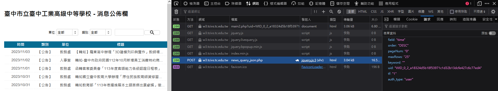
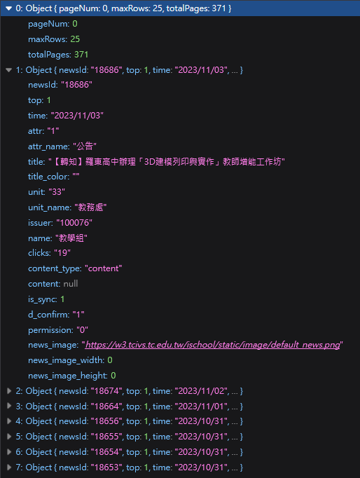

<style>
  :root{
      --color-background-code: #222222;
      --color-foreground: #FFF;
    }
  marp-pre,.language-python{
    border-radius: .5em;
    color:#FFF;
   padding: 1.2em!important;
  } 
  code{
    border-radius: 7px;
  }
  .small{
    font-size: 0.5em;
  
  }
  .l{
   text-align:left;
  }
</style>


# **PYTHON爬蟲**

112中電會聯合迎新

---

#### 關於我

# 毛哥EM
<div class="small">
喜歡用科技進行各種創作

如網頁設計、平面設計、音樂、電腦繪圖等

不獸控制

[elvismao.com](https://elvismao.com/)
</div>


---

# 今天要幹嘛

- Py基本語法
- 基本HTML
- 爬蟲原理
- 實作

---


# Discord
[點我](https://discord.gg/3wMeef9QP5)加入DC

---

# 甚麼是 Python?

Python 是一種直譯式、互動式、物件導向、腳本語言。
Guido van Rossum在1989花三個禮拜做的。

---
# 可以幹嘛

<div style="display:flex; justify-content: center;">
<div style="margin-right:3em">

* 程式邏輯教學
* 影像處理
* 演算法練習
* 軟體開發
* 大數據分析
</div>
<div>

* 網頁應用
* 圖表繪製
* 後端資料庫
* AI 深度學習
* 作業系統應用
* 遊戲引擎
* 韌體開發

</div>
</div>

---

```py

num1 = 1
num2 = 2
sum = num1 + num2
print("1+2等於", 3)

# 使用 for 迴圈列印數字 1 到 5
for i in range(1, 6):
    print(i)

```
---
# 安裝VS Code

---

<!-- _backgroundImage: #000 -->

# 下載並安裝


---

# 安裝python

---

<!-- _backgroundImage: #000 -->

### 下載完後執行


---

<!-- _backgroundImage: #000 -->

 Add python.exe to PATH 記得打勾
 忘記就重裝，不然很麻煩


---

<!-- _backgroundImage: #000 -->

### 安裝vscode插件


---

<!-- _backgroundImage: #000 -->

# Python<br>基礎語法


---

## 變數

<div class=l>

* 儲存資料
* 數字不可用於開頭字元。
* 可以使用英文字元、數字或下底線(`_`)命名
* 英文大小寫是有差異的
* 名稱不可使用python語言保留字詞。ex : for
* python會自己判斷資料型態

</div>

```python
x = "我是變數"
```

---

**輸出**
```python
print("Hello world")
```
**輸入**
```python
x = input("給IG嗎")
```

---
## 實作時間
#### 題目:詢問IG帳號，並輸出
> 溫馨提醒: 字串前後要加上`''` or `""`

```bash
給IG嗎?elvisdragonmao
IG是 elvisdragonmao
```

---
## 解答
```python
ig = input("給IG嗎?")
print("我會追蹤")
print(ig)
```

```python
ig = input("給IG嗎?")
print("我會追蹤", ig)
```

---

## 保留字

| and   | as   | assert | break    | class  | continue |
| ----- | ---- | ------ | -------- | ------ | -------- |
| def   | del  | elif   | else     | except | finally  |
| for   | from | False  | global   | if     | import   |
| in    | is   | lambda | nonlocal | not    | None     |
| or    | pass | raise  | return   | try    | True     |
| while | with | yield  |          |        |          |

---

## 資料型態
<div class=l>

* 數值型態(Numeric type) - int, float, bool
* 字串型態(String type) - str
* 容器型態(Container type) - list, set, dict, tuple
* 用type()查看資料型態
</div>

---

## 數值型態
* int - 整數
* float - 浮點數(有小數點)
* bool - true false

---
## 字串型態

* str(string)
  * 字串
  * 用`''`或`""`包住
  * 可用`+`連接
  * `len()`查看長度
---

## 陣列 list
(AKA 清單)

* 放多個資料的地方
* 用中括號`[]`包住
*  由中括號組成並以逗號隔開不同資料(型態可不同)
*  索引值從0開始

```python
i_am_list = [] # 宣告一個變數叫i_am_list
```

---

## 算術運算子
  * `+`加
  * `-`減
  * `*`乘
  * `/`除
  * `%`取餘數
---
## 關係運算子
`<`	小於
`>`	大於	
`<=`	小於等於	
`>=`	大於等於
`==`	相等	
`!=`	不相等	

---
## 練習時間
<div class=l>

**題目:** 鉛筆一支 5 元，一打 50 元。小明需要幫班上每位同學買一枝鉛筆，請問要多少錢？

由於小明~~是客家人~~很注重環保，他絕不會為了省錢而多買任何不需要的東西。也就是說，小明買的鉛筆數量一定等於班上的人數。

***測資:** 3:15, 50,210*
</div>

---

## code

```python
a = int(input())
print(a // 12 * 50 + a % 12 * 5)
```
---
## if
判斷條件 
* 對-->執行if中的程式  
* 錯-->跳出if往下執行，執行else


---

<!-- _backgroundImage: #000 -->

## else-if

* 用於多的條件時
* if執行時會跳過elif和else
* if是錯的-->判斷else-if，都錯-->執行else


---

```python
x = True
y = False
if y:               # False
  print("No way")
elif x and y:       # True and False
  print("come on!")
elif not x:         # not True
  print("please")
else                # do this
  print("嗨壓")
```

---
## 迴圈
重複執行類似的事


---
## for 
可以透過Python迴圈來讀取串列中的每一個元素
較適用於「已知迴圈數」的問題

```python
for x in range(1, 10, 2):
   # 放要執行的東西
```

range(起始值,結束值,間距值)

---

## while
較適用於「無法預知迴圈數」的問題

```python
while 條件:   # 條件成立
    # 放要執行的東西
```

---
## break
強制跳出整個迴圈
```python
for i in range(1,5):
    if(i == 3):
        continue
    print(i) # 會列出1 2
```
---
## continue
強制跳出這過迴圈
```python
for i in range(1,5):
    if(i == 3):
        continue
    print(i)
```
```
1
2
4
```

---

# 網頁原理

---


---

# HTML

---

## HTML
超文本標記語言(HyperText Markup Language)
網站的骨架


---

# 元素

網站所有東西都是由元素組成


---

# 文字

```html
  <p>段落
    <b>粗體</b>
    <i>斜體</i>
    <s>刪除線</s>
    <u>底線</u>
    H<sup>+</sup>
  CO<sub>2</sub>
  </p>
```

---


**粗體**
*斜體*
~~刪除線~~
<u>底線</u>
  H<sup>+</sup> CO<sub>2</sub>

---

# 圖片

格式

```html

```

範例

```html

```


---

# 網路爬蟲和它的應用

---

# 什麼是網路爬蟲

- 從網際網路上擷取資料
    - 可以爬重要的資訊:校網
    - 下載網站沒有提供允許下載的內容
    - 如: 線上漫畫、曾博恩《破蛋者》
- 可以模擬人類在網頁上的瀏覽行為
    - 進入網站、點擊按鈕、輸入文字、下載檔案等

---


---

# **資安宣導**

* 不可以壞壞
* 不可以做違法的事
* 閱讀網站的使用條款和服務條款
* 不應該對網站造成過大的負擔或破壞
* 要做後果自負，不要說是我教的

---

## robot.txt

<!-- _backgroundImage: #000 -->

- 告知網路爬蟲哪些網頁可以被訪問或爬取
- 遵守網站的使用規則
- 減少伺服器負載以及保護網站免受不必要的訪問


---

## 常見的robots.txt規則
 1. 允許所有爬蟲訪問整個網站
```
User-agent: *
Allow: /
```
2. 禁止所有爬蟲訪問整個網站
```
User-agent: *
Disallow: /
```

---

# **靜態爬蟲**
- 顧名思義就是只能專門爬靜態網站的爬蟲
- 靜態網站：預先產生好 HTML 直接給你爬
- 優點：速度快，好爬
- 缺點：有的網站是載入時才生成內容，爬不到

---

# 來點酷酷的庫

```bash
pip3 install <庫名稱>
```

---

# Requests
<div class=l>

- 讓你可以用簡單的Python去對網站做請求
- 請求時可以帶點伴手禮
  自訂Header、帶參數、cookie,、User-Agent...
- 一直請求人家或著是按門鈴又躲起來就叫做 DDOS 攻擊
- 有可能會被網站 ban 掉

</div>

```python
pip3 install requests
```

---

# BeautifulSoup
- aka美麗湯，用來處理HTML中的資料
- 會需要有**語法分析器**去分析HTML
    - e.g: lxml, html5lib(這邊使用html5lib)
    - 不同語法分析器會有速度、結果的不同，有容錯率之別
```python
pip3 install beautifulsoup4
```

---

# 下載
```
pip3 install requests beautifulsoup4 html5lib
```
---

# 靜態爬蟲實作
<div class=l style=margin-left:80px>

### 流程
1. 利用Python程式進行HTTP請求
2. 利用HTML解析器(美麗湯4)處理資料
3. 分析及利用網頁資源

</div>

---

### 試試看

```python
import requests
from bs4 import BeautifulSoup
a = ""
url = 'https://zh.wikipedia.org/zh-tw/臺中高工'

response = requests.get(url)
if response.status_code == 200:
    page_content = response.text
    print(wiki)
```

---

我們來抓抓看維基百科條目的第一段介紹8

```python
import requests
from bs4 import BeautifulSoup
url = 'https://zh.m.wikipedia.org/zh-tw/台中高工'
response = requests.get(url)
if response.status_code == 200:
    page_content = response.text
    soup = BeautifulSoup(page_content, 'html5lib')

    wiki = soup.find_all('p')[0].get_text()
    if wiki.replace("\n", "").strip() == '':
        wiki = soup.find_all('p')[1].get_text()
    print(wiki)
```

---

<!-- _backgroundImage: #000 -->

> 臺中市立臺中工業高級中等學校，簡稱臺中高工、中工，是一所位於臺灣臺中市南區的技術型高級中等學校，創立於1938年，最初校名為臺中州立臺中工業學校，首任校長為村田
務；1955年中華民國教育部接受美援購買先進儀器將其模式導入包括該校及全國另外七所高工，為臺灣八大省工之一，現為教育部電機電子群科中心學校。該校對外交通較為便利
，鄰近的交通設施有高鐵臺中站、大慶車站、捷運大慶站等。

---

# 挑戰

先問使用者要爬哪個維基百科條目
然後把他的第一段介紹爬下來顯示出來

---

# 解答

```python

# 爬爬校園公告

---

- 引入需要用到的模組
- 進入到[學校公告](https://ljjhs.tc.edu.tw/p/403-1080-1244-1.php?Lang=zh-tw)並複製他的網址
- 用名叫url的變數儲存這條網址(字串)
- 以GET方式向網站請求資料，並儲存到變數
```python
from bs4 import BeautifulSoup
import requests
url = "網址"
response = requests.get(url).text
print(response) #看看他的HTML
```

---

把response丟給美麗湯4解析

```python
soup = BeautifulSoup(response, 'html5lib')

```

---

### **接下來我們來分析一下公告的HTML**

---


不難發現，整個我們想要的資料都在這個tbody標籤中

---


而在tbody中有一個一個**td**標籤

---

1. 找到tbody(資料的外框)
2. 從tbody中找出所有的`<a>`
3. 把它print出來看看

```python
tbody = soup.find('tbody') #6
a_tag_list = tbody.find_all('a') #7
print(a_tag_list) #8
```

---


--- 

- 可以發現他是個由`<tr>`底下的`<a>`組成的列表
- 再來用for迴圈去跑這些`<a>`
  - 取裡面href跟title屬性的值存到list裡

```python

for a_tag in a_tag_list:
    links_list.append(a_tag.get('href')) 
    titles_list.append(a_tag.get('title')) 

```

---

除了連結跟標題外我們再蒐集日期。
日期是存在特定td的div裡的，取出後一樣存在list裡

```python

td_tag_list = tbody.find_all('td', attrs={"data-th" : "日期"}) 
for td_tag in td_tag_list:
    div = td_tag.find("div")
    dates_list.append(div.text.strip())

```
> strip()是用來刪去字串中某些特定字元的
  預設是空白

---

Full Code

<!-- _backgroundImage: #000 -->

```python
from bs4 import BeautifulSoup
import requests
url = "https://ljjhs.tc.edu.tw/p/403-1080-1244-1.php?Lang=zh-tw"
titles_list = []
links_list = []
dates_list = []
response = requests.get(url).text#得到HTML
```

---

<!-- _backgroundImage: #000 -->

```python
soup = BeautifulSoup(response, 'html5lib')#丟進美麗湯解析

tbody = soup.find('tbody')
a_tag_list = tbody.find_all('a')
for a_tag in a_tag_list:
    links_list.append(a_tag.get('href')) 
    titles_list.append(a_tag.get('title')) 
td_tag_list = tbody.find_all('td', attrs={"data-th" : "日期"}) 
for td_tag in td_tag_list:
    div = td_tag.find("div")
    dates_list.append(div.text.strip())

for i in range(len(titles_list)):
    print(dates_list[i],titles_list[i], links_list[i])
```

---

## 乖乖讀公告的方式

* RSS - 一種讓你輕鬆地追蹤網站的更新，類似於一個個性化新聞訂閱服務。(如:部落格文章，Podcast都會提供API讓你不需要使用爬蟲就可以取得資料)
* API - 有些網站會提供一個網址讓你去請求資料，並且會以JSON格式回傳資料。

---

### 使用 API 來讀取台中高工的公告

首先我們要先來看看[台中高工網頁](https://w3.tcivs.tc.edu.tw/ischool/widget/site_news/main2.php?uid=WID_0_2_a18324d5b18f53971c1d32b13dcfe427c6c77ed4&maximize=1&allbtn=0)是如何讀取公告的。
可以在開發者工具看出他是去找[這個網址](https://w3.tcivs.tc.edu.tw/ischool/widget/site_news/news_query_json.php)並提供一些參數(伴手禮)來取得公告。我們只需要把這個網址複製下來，並且帶著伴手禮就可以偷到公告了，不需要去爬網頁還需要去整理 HTML。

---
<!-- _backgroundImage: #000 -->


---



---

<!-- _backgroundImage: #000 -->

## 範例程式碼

```python
import requests

url = "https://w3.tcivs.tc.edu.tw/ischool/widget/site_news/news_query_json.php"
data = {"field": "time", "order": "DESC", "pageNum": "0", "maxRows": "25", "keyword": "", "uid": "WID_0_2_a18324d5b18f53971c1d32b13dcfe427c6c77ed4", "tf": "1", "auth_type": "user"}
response = requests.post(url, data=data)
if response.status_code == 200:
    news_data = response.json()

    latest_news = news_data[1:6]
    for news in latest_news:
        date = news['time']
        title = news['title']
        news_id = news['newsId']
        
        print(f"日期: {date}\n{title},\nhttps://w3.tcivs.tc.edu.tw/ischool/public/news_view/show.php?nid={news_id}\n\n")
else:
    print(f"失敗代碼: {response.status_code}")


```

---

# 動態爬蟲實作
## **Selenium**

---

# Selenium
- 可以用程式語言(Python、C#等等)操作網頁
- 可以模擬使用者操作(點擊、填寫文字、滑動)

---

# 來點有趣的
## **去低(~~能~~)卡爬梗圖**

---


---

先講解一下等等會用到的一些函式
- driver.find_elements(By.id, By.XPATH ......)
  - 等等會用XPATH，因為賊好用
  - ##### **XPATH介紹在下一頁**
- element.get_attribute("attr")
  - 取得Tag中特定屬性的值
- string.startswith("123")
  - 如果字串的開頭是123的話回傳True，反之為False。
- driver.execute_script('JavaScript')
  - 能用Selenium執行JavaScript

---
- time.sleep(1)
  - 直接讓程式**睡**1秒
- list.append('2')
  - 可以直接在list的後面多加入一個東西
  - e.g:
  ```python
    number_list = [0, 1]
    list.append('2')
    >>> [0, 1, 2]
  ```


---


---

- 引入需要的模組
- 去複製[Dcard梗圖板](https://www.dcard.tw/f/meme)的網址
- 先開2個list一個存src內的網址
  - 一個存請求後的圖片位置(這才是我們要的)
- 用driver請求Dcard
- 在請求後等一下讓他載入
  - 用time.sleep(second) #等待second秒


---

```python
from selenium import webdriver
from selenium.webdriver.common.by import By
import time 
import requests

url = "https://www.dcard.tw/f/meme"
driver = webdriver.Chrome() #也可以是Edge(), Firefox(), etc.
page_link_list = [] #空list
img_link_list = [] #空list
driver.get(url)
time.sleep(5) #等待網頁載入可以久一點點沒關係

```

---

<!-- _backgroundImage: #000 -->


- 可以發現圖片是用``表示
  - 更方便的是，他的連結就直接在src中，
  所以我們要做的就是請求那個連結後下載回傳的結果！

---

- 因為可以發現，所有圖片有一個alt屬性且名稱都是megapx。
  - 我們可以用By.XPATH快樂的找Tag
- 找到了元素後，取他src的值，存進page_elements_list
- 把頁面往下滑
```python
 page_elements = driver.find_elements(By.XPATH, "//img[@alt='megapx']")
 page_elements_list.append(page_elements.get_attribute("src"))
 driver.execute_script("window.scrollTo(0,document.body.scrollHeight);")
```

---

#### **這個動作要重複好多遍，所以用迴圈做ㄅ**

---

```python
for i in range(0, 5): #可以把後面的值設定大一點，代表一次抓多一點圖片
    page_elements = driver.find_elements(By.XPATH, "//img[@alt='megapx']")
    for page_element in page_elements:
        if page_element.get_attribute("src").startswith("https"):  #確保存的是網址
            page_link_list.append(page_element.get_attribute("src"))
    driver.execute_script("window.scrollTo(0,document.body.scrollHeight);")
    time.sleep(0.5) #每次划完後等待載入
```

---

#### **這邊講解一下為何不能直接載這個圖片：**

因為我們這時候存到的link觀察一下可以發現
它的結尾並不是正常的圖片格式，那我們直接
請求後下載是沒有用的，我們必須請求後找到
圖片真正的位置，請求後下載才會有用。

---


---

<!-- _backgroundImage: #000 -->


---

## 下載圖片

```py
import requests

url = "圖片的連結"  # 替換為要下載的圖片連結
response = requests.get(url)

# 檢查圖片是否下載成功
if response.status_code == 200:
    with open("圖片檔名.jpg", "wb") as file:
        file.write(response.content)
        print("圖片下載成功")
else:
    print("無法下載圖片")
```

---

## 打開圖片

```py
import requests
from PIL import Image

url = "圖片的連結"  # 替換為要下載的圖片連結
response = requests.get(url)

# 檢查圖片是否下載成功
if response.status_code == 200:
    with open("圖片檔名.jpg", "wb") as file:
        file.write(response.content)
        print("圖片下載成功")

    # 打開圖片
    img = Image.open("圖片檔名.jpg")
    img.show()
else:
    print("無法下載圖片")

```

# 迴圈

<!-- _backgroundImage: #000 -->

一次下載多張圖片

```py
import requests

def download_images(image_links):
    for index, link in enumerate(image_links):
        try:
            response = requests.get(link)
            response.raise_for_status()
            with open(f"image_{index+1}.jpg", "wb") as file:
                file.write(response.content)
            print(f"Image {index+1} downloaded successfully.")
        except requests.exceptions.RequestException as e:
            print(f"Error downloading image {index+1}: {e}")

# Example usage
image_links = [
    "https://picsum.photos/200/300",
    "https://picsum.photos/200/300","https://picsum.photos/200/300","https://picsum.photos/200/300","https://picsum.photos/200/300",
]

download_images(image_links)
```
---

# 使用pyinstaller包裝成exe

---

安裝 pyinstaller

```bat
pip3 install pyinstaller
```

打包成exe
```bat
pyinstaller -F code.py
pyinstaller -F code.py -i "a.ico"
```
* `-F` 打包成單一檔案  
* `-i` 設定圖示

---

### 謝謝大家
感謝大家的參與